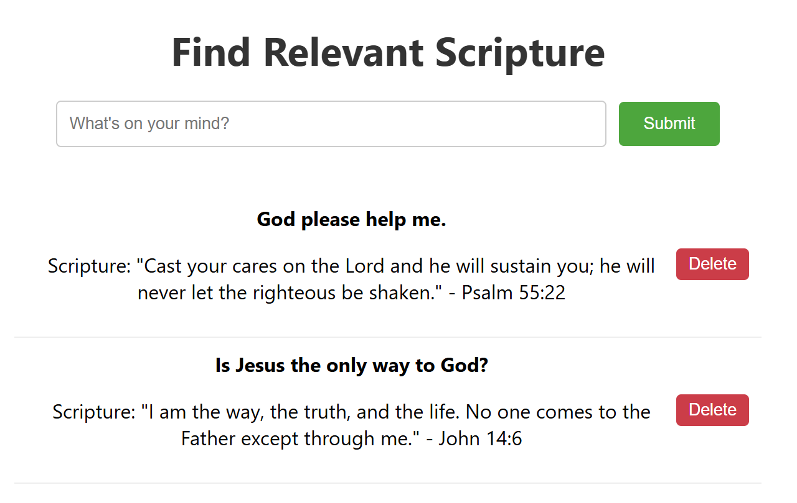

# Find Bible Scripture

A simple locally run webpage built with FastAPI/ReactJS backend/frontend to manage scriptures.

## Directory

   ```
   project/
   ├── backend/
   │   ├── main.py
   │   ├── models.py
   │   ├── database.py
   │   └── ollama_client.py
   └── frontend/
       ├── public/
       │   ├── index.html
       │   └── favicon.ico (optional)
       ├── src/
       │   ├── App.js
       │   ├── App.css
       │   ├── components/
       │   │   ├── TaskForm.js
       │   │   └── TaskList.js
       │   ├── index.css
       │   └── index.js
       └── package.json
   ```

## Features
- LLM integration
- Database can be created to save the record
- FastAPI: asynchronous and fast execution
- ReactJS: server-side rendering allows React components to be rendered on the server and sent to the browser as fully rendered HTML

## Prerequisites
- Python 3.8+
- Node.js 18+ and npm
- Ollama installed (https://ollama.com/)
- Git

## Setup
1. Clone the repository:
   ```bash
   git clone https://github.com/pjlau/bible-scripture-llm.git
   cd bible-scripture-llm
2. Install backend dependencies:
   ```bash
   pip install fastapi uvicorn pydantic
3. Ensure the Ollama is installed:
   ```bash
   ollama --version
4. Pull a free LLM model (e.g. `phi3` for efficiency):
   ```bash
   ollama pull phi3
5. Serve the LLM model (e.g. `phi3` for efficiency):
   ```bash
   ollama serve
6. Run the Web App:
   ```bash
   cd backend
   uvicorn main:app --reload --port 8000
7. Install frontend dependencies:
   ```bash
   cd frontend
   npm install
8. Start the React development server:
   ```bash
   npm start
9. Access the web app at `http://localhost:3000/`.

## Results


